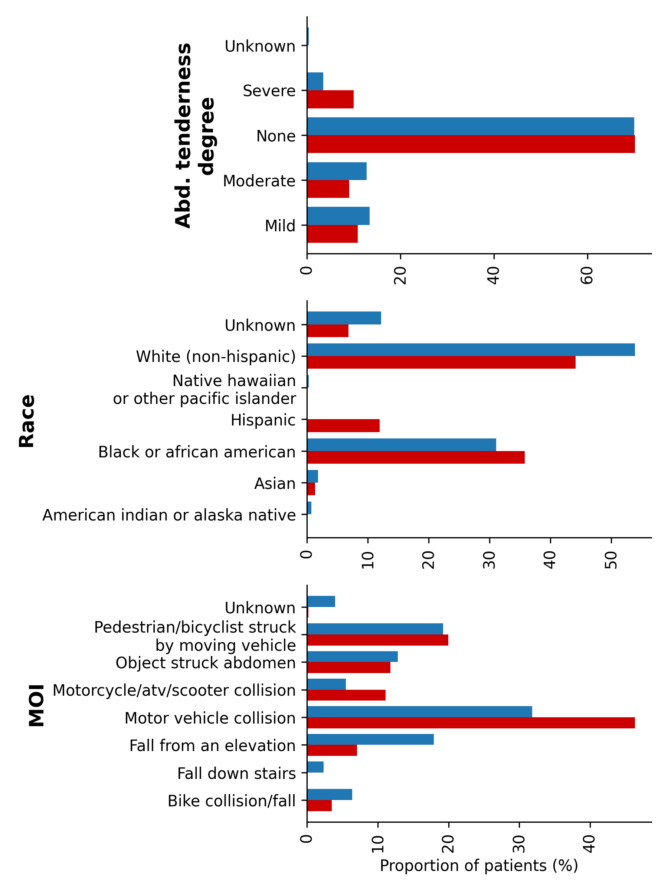
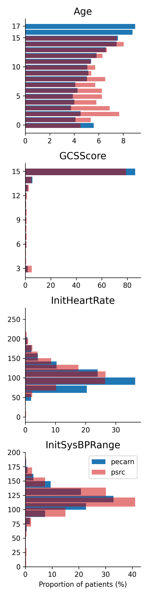
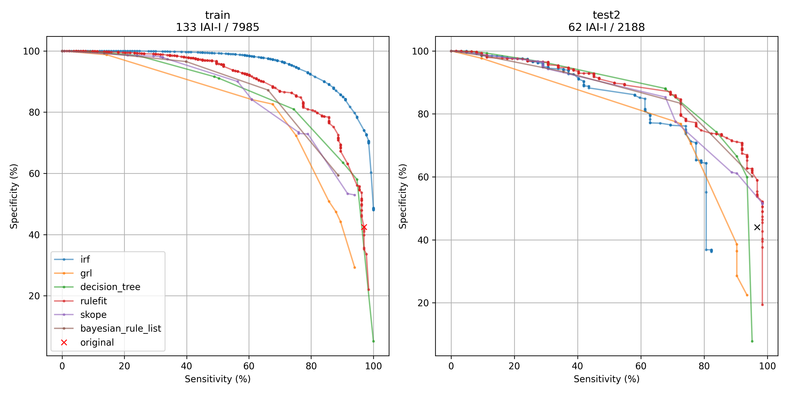

<h1 align="center"> Stable clinical rule learning.</h1>
<p align="center"> Demonstrating the use of PDR/PCS in emergency medicine on the PECARN dataset. 
</p>
<p align="center"> Accompanies the paper <i>"Predictability and stability testing to assess clinical decision instrument performance for children after blunt torso trauma
"</i> (<a href="https://journals.plos.org/digitalhealth/article?id=10.1371/journal.pdig.0000076">PLOS digital health, 2022</a>)
</p>
<p align="center">

  
  <a href="https://github.com/Yu-group/pcs-pipeline/actions"></a>
  
</p> 

Code for reproducing analysis evaluating the PECARN Clinical Decision rule for prediction Intra-abdominal injury requiring intervention (IAI-I). 
Documentation for useful functions is [here](csinva.io/iai-clinical-decision-rule) and for a thorough look into the notebooks is [here](https://github.com/csinva/iai-clinical-decision-rule/tree/master/notebooks).

# PCS documentation

## 1. Domain problem formulation

Our goal is to be able to identify the risk of clinically important traumatic brain injury (ciTBI) among children. This information can be used to triage CT imaging.

The outcome is definite to be Intra-abdominal injury requiring intervention (IAI-I).

## 2. Data collection and storage

Protocol for screening subjects is given in the [PECARN paper](https://www.annemergmed.com/article/S0196-0644(12)01743-X/fulltext) (i.e. children presenting within 24 h of non-trivial head trauma) and the [PSRC paper](https://www.sciencedirect.com/science/article/abs/pii/S1072751517300376). Data is now open-source and available as a series of csv and accompanying pdf files providing details on how it was collected.

## 3. Data cleaning and preprocessing

After matching features between the PECARN and PSRC data, we get histograms as shown below:




The definition of the outcome is the most difficult part. Categorical features are one-hot encoded.

## 4. Exploratory data analysis

Split up preverbal (<2 years of age) and verbal (>=2 years of age) patients.

## 5. Modeling and Post-hoc analysis

Many different models are fit and achieve different sensitivity/specificity tradeoffs.



## 6. Interpretation of results

We are able to rederive reasonable rule-based models for IAI prediction.


# Reference
- IAI data is gratefully downloaded from the open-source [PECARN website](http://pecarn.org/studyDatasets/Default) (also available here in the [data](data) folder)
    - unfortunately, PSRC data is not available open-source at this time
- makes heavy use of the [imodels](https://github.com/csinva/interpretability-implementations-demos) package


```R
@article{kornblith22iaiclinical
    doi = {10.1371/journal.pdig.0000076},
    author = {Kornblith, Aaron E. AND Singh, Chandan AND Devlin, Gabriel AND Addo, Newton AND Streck, Christian J. AND Holmes, James F. AND Kuppermann, Nathan AND Grupp-Phelan, Jacqueline AND Fineman, Jeffrey AND Butte, Atul J. AND Yu, Bin},
    journal = {PLOS Digital Health},
    publisher = {Public Library of Science},
    title = {Predictability and stability testing to assess clinical decision instrument performance for children after blunt torso trauma},
    year = {2022},
    month = {08},
    volume = {1},
    url = {https://doi.org/10.1371/journal.pdig.0000076},
    pages = {1-16},
    number = {8},

}
```
